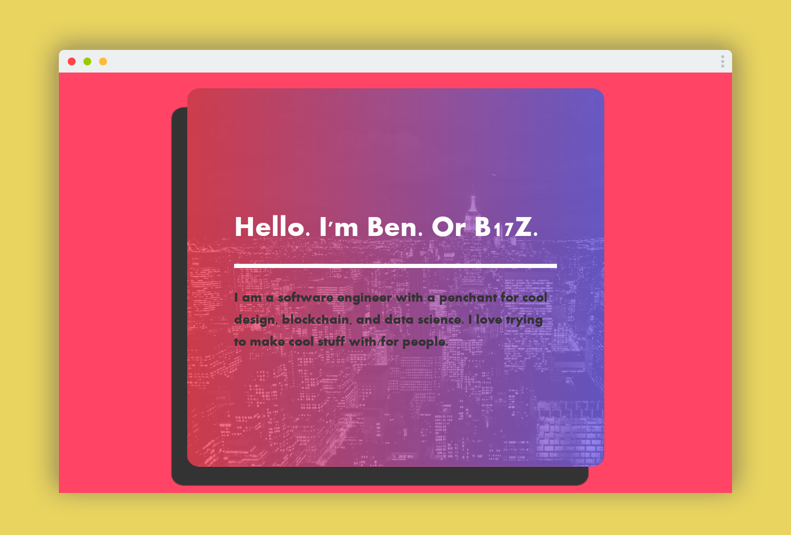

# B17Z
B17Z Landing Page

# Why Did I Create This

Screenshot taken with [Screen Guru](https://screen.guru)

I wanted to have my own landing page that I created from scratch. Figured it was good practice for web development.

# How to Use

`
cd public
`

`
npm i
`

`
npm run start
`

# Technologies Used
- HTML5
- [Sass](https://sass-lang.com/). My preferred styling option.
- CSS Flexbox
- [Firebase](https://firebase.google.com/) for hosting.

# Future Features
- [ ] Navigation (In this case, I thought it wasn't needed since it's a short scroll)
- [ ] Animations and hover effects
- [ ] Better designed buttons

# Finished
- [x] Mobile friendly (except for sideways mobile view) 
